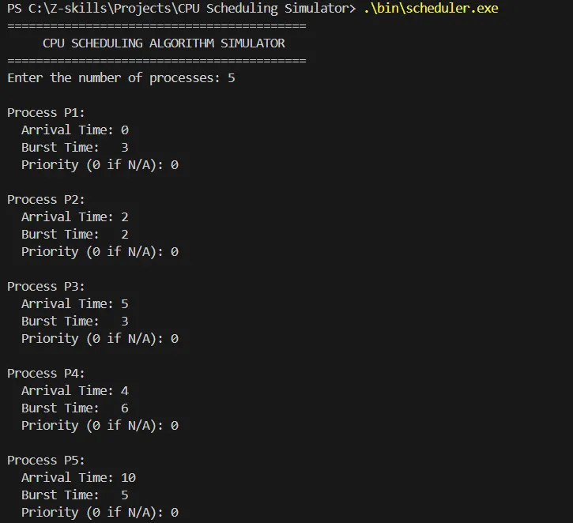
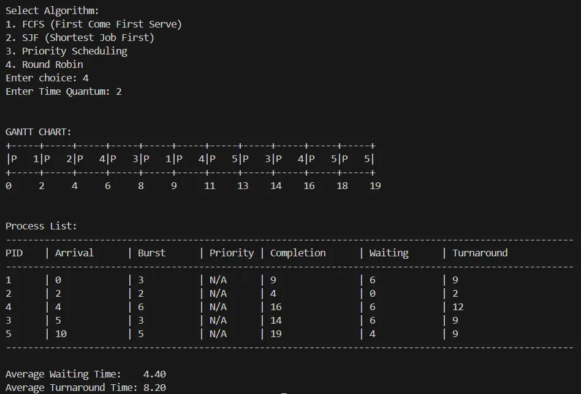
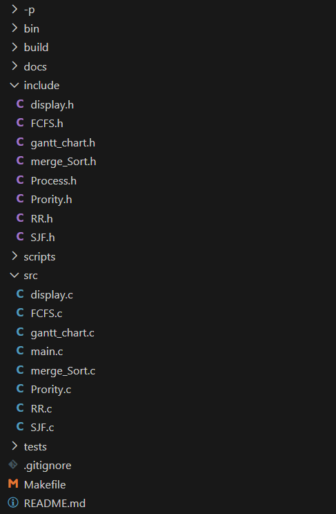

# 🚀 CPU Scheduling Simulator

A robust, interactive CLI tool that simulates various CPU scheduling algorithms. Unlike standard implementations that rely on fixed arrays, this project is built entirely using **Dynamic Linked Lists**

to efficiently handle process management and memory.

This tool calculates critical metrics (Waiting Time, Turnaround Time) and visualizes process execution with a dynamic  **text-based Gantt Chart**.

## **🎯 Key Features**

- **Dynamic Memory Management:** Implemented using ***Linked Lists**** (no static arrays), demonstrating efficient memory usage and pointer manipulation in C.
- **Custom Algorithms:** Features a hand-written ***Merge Sort**** optimized for linked lists to handle arrival time and priority sorting ($O(n \log n)$ complexity).
- **Visual Gantt Chart:** Generates a timeline visualization of the CPU schedule directly in the terminal.
- **Multiple Algorithms Supported:**

### First Come First Serve (FCFS)

### Shortest Job First (SJF) - Non-preemptive

### Priority Scheduling - Non-preemptive

### Round Robin (RR) with configurable Time Quantum





## **🛠️ Installation & Build**

This project uses a  **Makefile** for easy compilation. You need `gcc` installed.

 **1. Clone the Repository**

```jsx

git clone https://github.com/ThoughtStorm06/cpu-scheduler.git

cd cpu-scheduler

```

 **2. Compile**

```jsx
make
```

if the above command doesn’t work ,try:

```jsx
mingw32-make  
```

- *This compiles all source files from `src/` and places the executable in `bin/`.**

**3. Run**

# Windows

```jsx
.\bin\scheduler.exe
```

# Linux / Mac / Git Bash

```jsx
./bin/scheduler

```

**4. Clean Up**

To remove compiled object files and binaries:

```jsx
make clean
```

or

```jsx
mingw32-make clean
```

## **📂 Project Structure**

The project follows a modular "Separation of Concerns" architecture:



## **🧠 Technical Highlights**

- **Round Robin Implementation:** Simulates a circular queue by manipulating linked list pointers rather than using an auxiliary array.
- **Merge Sort:** I implemented a custom merge sort for the linked list to ensure stable sorting of processes based on Arrival Time and Burst Time.
- **Tail Pointer Optimization:** Used tail pointers during list creation to ensure insertion time for new Gantt chart nodes.

## **🤝 Contributing**

Open to contributions! Feel free to fork the repository and submit a pull request.

1. Fork the Project

2. Create your Feature Branch (`git checkout -b feature/AmazingFeature`)

3. Commit your Changes (`git commit -m 'Add some AmazingFeature'`)

4. Push to the Branch (`git push origin feature/AmazingFeature`)

5. Open a Pull Request